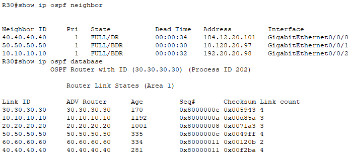
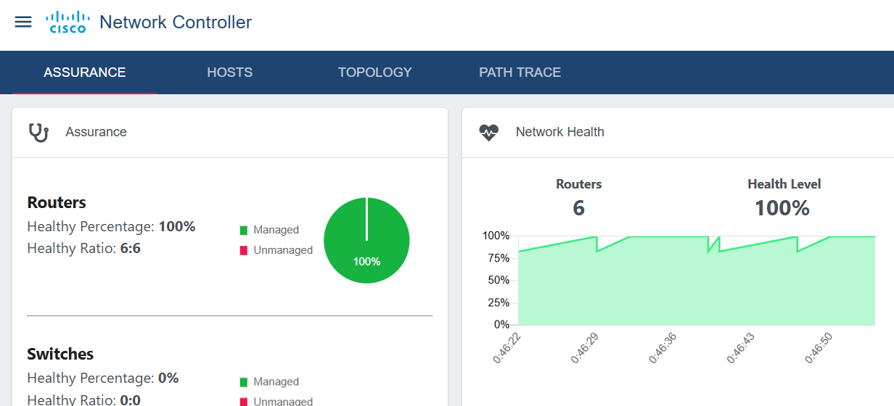
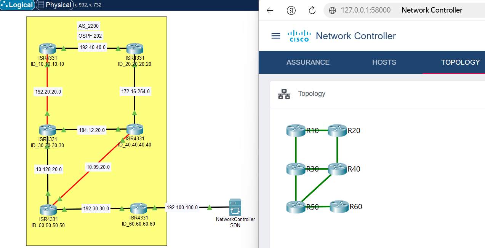
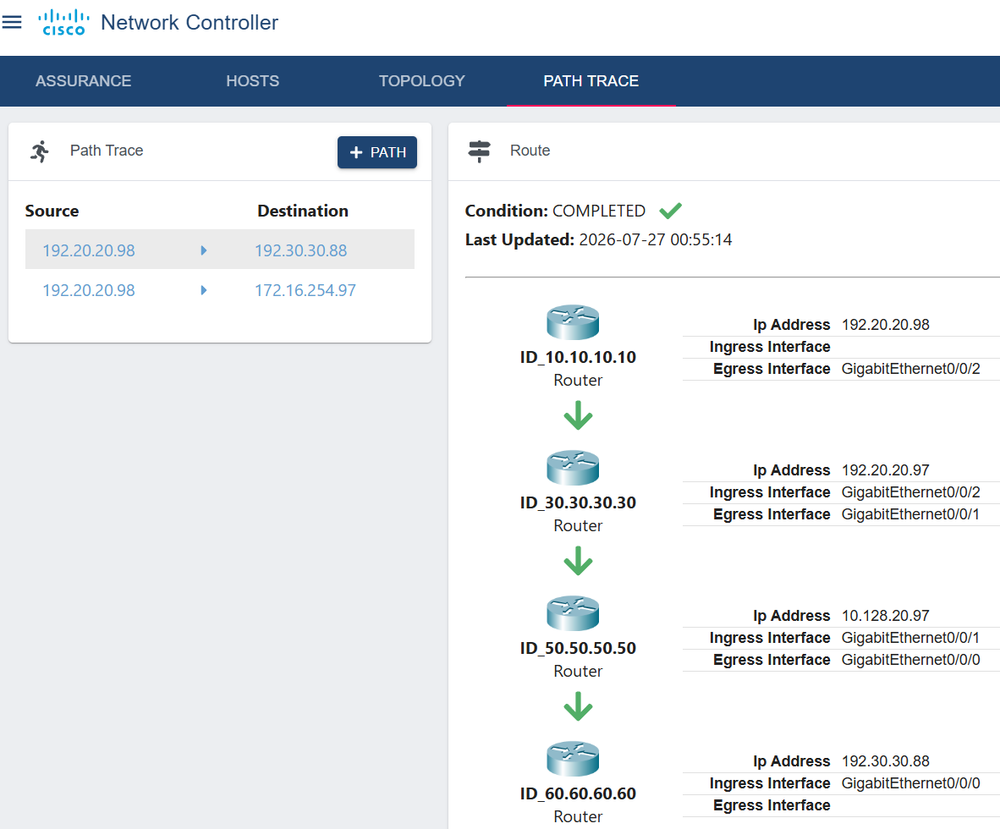

# SDN-Controller

## 1. О проекте

**Цель:** Создать сеть, управляемую SDN контроллером.

**Что сделано:**

- Развернута сеть 6 маршрутизаторов
- Поднят OSPF
- Настроены SSH v2, SNMP, VTY на всех устройствах
- Подключен SDN контроллер

## 2. Архитектура

### Инфраструктура

Стенд развёрнут в Cisco Packet Tracer:

- **R10–R60** — 6 маршрутизаторов Cisco ISR4331 (IOS 15.4 / 16.6.4).
- **SDN** — Cisco Network Controller

Все маршрутизаторы находятся в одной OSPF-области (area 1) и связаны между собой.

### Размещение компонентов

- **R10–R60** — маршрутизация OSPF 202
- **SDN-контроллер** — управление, мониторинг и визуализация топологии.

## 3. Развёртывание

### Требования

- Cisco Packet Tracer.
- Маршрутизаторы ISR4331 или аналоги
- SDN-контроллер Network Controller

### Конфигурация

Для развёртывания используются конфигурации маршрутизаторов:

```bash
configs/ID_10.10.10.10_running-config.yaml
configs/ID_20.20.20.20_running-config.yaml
configs/ID_30.30.30.30_running-config.yaml
configs/ID_40.40.40.40_running-config.yaml
configs/ID_50.50.50.50_running-config.yaml
configs/ID_60.60.60.60_running-config.yaml
```

### Проверка

Убедиться, что все OSPF-соседства в состоянии FULL:



Проверить, что SDN видит все 6 маршрутизаторов:



Все 6 маршрутизаторов в статусе `Managed`, Health Level 100%.

Проверить топологию в SDN:



Все линки зелёные.

Проверить трассировку пути от R10 до R60:



Path Trace завершён успешно (`Condition: COMPLETED`).

## 4. Известные ограничения

- **Устаревшие маршрутизаторы Cisco 2811 (IOS 15.1) не поддерживаются SDN-контроллером.**
  SDN мог пингануть устройство, но не мог собрать конфигурацию. В интерфейсе SDN такие устройства отображались со статусом:
  - `CLI Status = NOT_VALIDATED`
  - `Collection Status = Unsupported`

  **Решение:** замена всех маршрутизаторов Cisco 2811 на Cisco ISR4331 (IOS 15.4 / 16.6.4). После замены все устройства корректно определились как `Router` с платформой `ISR4331` и перешли в статус `Managed`.


## Контакты

**Автор:** Александр Орёл

**E-mail:** oryol.aleks@yandex.ru
**GitHub:** [aleks858](https://github.com/aleks858)
